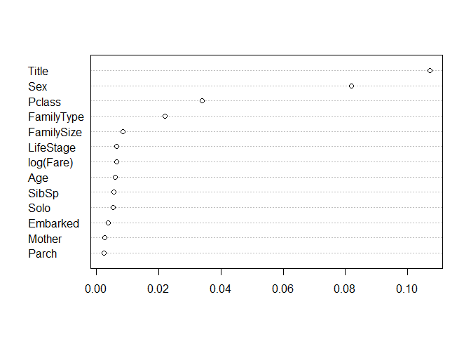

# A (mostly!) tidyverse tour of the Titanic
Andrew Kinsman  
30 May 2017  

## Introduction

The evolution of the R programming language has taken some major steps forward in recent years, in large part due to the creative efforts of R Studio's Chief Data Scientist, Hadley Wickham, who has given us ggplot2 (for visualisation), dpylr (for data manipulation), tidyr (for data tidying) etc. These (and many other) programs have now been brought together into a single package, known as "tidyverse". By installing this package and then opening the tidyverse library, users now have immediate access to the core ggplot2, dplyr, tidyr, readr, tibble and purrr packages without the need to open a series of individual packages one by one. Furthermore, the tidyverse package downloads numerous other, somewhat less general but still very helpful libraries (such as stringr, for string manipulation, and forcats, for dealing with categorical data), that can be accessed in the normal way, library(), negating the need to keep going off looking for individual packages to download.

However, the ease of access to these packages is only one small aspect of tidyverse. More importantly, the idea of tidyverse is to create a "universe" of related packages with a uniform interface - once you have learned how to use one of the tidyverse tools, the others should be quick to pick up since they all follow the same basic approach. It's well worth checking out Hadley Wickham's [tidy tools manifesto](https://mran.microsoft.com/web/packages/tidyverse/vignettes/manifesto.html) for a brief overview of his objectives.

So what is tidy data anyhow? Let's use [Hadley Wickham's explanation](http://vita.had.co.nz/papers/tidy-data.html): "Tidy datasets are easy to manipulate, model and visualize, and have a specific structure: each variable is a column, each observation is a row, and each type of observational unit is a table." Often it takes considerable cleaning and manipulation before a dataset can be considered "tidy". In the wild most data is very far from tidy, but sometimes (as with Kaggle Titanic) our data is provided in a neatly presented format that isn't too  messy. In that case, we are free to focus more of our attention on things like feature engineering and dealing with missing values, all of which can of course be carried out using tidyverse. 

Before moving on, I should mention that the excellent free online book [R for Data Science](http://r4ds.had.co.nz/), co-authored by Garrett Grolemund and Hadley Wickham, provides a comprehensive overview of tidy data, with plenty of examples and exercises to help you get underway.

Anyhow, that's enough introduction, let's crack on with some "tidyversing" of our own. We'll start by loading up the tidyverse library and importing the data using read_csv() (from readr). Note that compared to read.csv() in base R we don't need to set stringAsFactors to be False here - in readr strings default to characters rather than factors. We can make any decisions about factors later on. 

# Data Preparation


```r
library(tidyverse)

setwd("C:/Users/aphki/Documents/R_Working_Directory/Kaggle Titanic")
train <- suppressMessages(read_csv("train.csv"))
test <- suppressMessages(read_csv("test.csv"))
class(train)
```

```
## [1] "tbl_df"     "tbl"        "data.frame"
```

You may be wondering what a "tbl_df" is. It's short for tibble dataframe, which is just a new, enhanced version of the standard data frame that you are probably already very familiar with. You can still use all the usual functions with a tibble, but it has some additional capabilities that come in very handy.

dplyr contains the glimpse function that enables us to take a quick look at the data.


```r
glimpse(train)
```

```
## Observations: 891
## Variables: 12
## $ PassengerId <int> 1, 2, 3, 4, 5, 6, 7, 8, 9, 10, 11, 12, 13, 14, 15,...
## $ Survived    <int> 0, 1, 1, 1, 0, 0, 0, 0, 1, 1, 1, 1, 0, 0, 0, 1, 0,...
## $ Pclass      <int> 3, 1, 3, 1, 3, 3, 1, 3, 3, 2, 3, 1, 3, 3, 3, 2, 3,...
## $ Name        <chr> "Braund, Mr. Owen Harris", "Cumings, Mrs. John Bra...
## $ Sex         <chr> "male", "female", "female", "female", "male", "mal...
## $ Age         <dbl> 22, 38, 26, 35, 35, NA, 54, 2, 27, 14, 4, 58, 20, ...
## $ SibSp       <int> 1, 1, 0, 1, 0, 0, 0, 3, 0, 1, 1, 0, 0, 1, 0, 0, 4,...
## $ Parch       <int> 0, 0, 0, 0, 0, 0, 0, 1, 2, 0, 1, 0, 0, 5, 0, 0, 1,...
## $ Ticket      <chr> "A/5 21171", "PC 17599", "STON/O2. 3101282", "1138...
## $ Fare        <dbl> 7.2500, 71.2833, 7.9250, 53.1000, 8.0500, 8.4583, ...
## $ Cabin       <chr> NA, "C85", NA, "C123", NA, NA, "E46", NA, NA, NA, ...
## $ Embarked    <chr> "S", "C", "S", "S", "S", "Q", "S", "S", "S", "C", ...
```

glimpse() tells us how many observations and variables there in the dataset, and also provides the class of each variable and the first few observations of each variable. It's somewhat analogous to the str() function in base R. 


```r
glimpse(test)
```

```
## Observations: 418
## Variables: 11
## $ PassengerId <int> 892, 893, 894, 895, 896, 897, 898, 899, 900, 901, ...
## $ Pclass      <int> 3, 3, 2, 3, 3, 3, 3, 2, 3, 3, 3, 1, 1, 2, 1, 2, 2,...
## $ Name        <chr> "Kelly, Mr. James", "Wilkes, Mrs. James (Ellen Nee...
## $ Sex         <chr> "male", "female", "male", "male", "female", "male"...
## $ Age         <dbl> 34.5, 47.0, 62.0, 27.0, 22.0, 14.0, 30.0, 26.0, 18...
## $ SibSp       <int> 0, 1, 0, 0, 1, 0, 0, 1, 0, 2, 0, 0, 1, 1, 1, 1, 0,...
## $ Parch       <int> 0, 0, 0, 0, 1, 0, 0, 1, 0, 0, 0, 0, 0, 0, 0, 0, 0,...
## $ Ticket      <chr> "330911", "363272", "240276", "315154", "3101298",...
## $ Fare        <dbl> 7.8292, 7.0000, 9.6875, 8.6625, 12.2875, 9.2250, 7...
## $ Cabin       <chr> NA, NA, NA, NA, NA, NA, NA, NA, NA, NA, NA, NA, "B...
## $ Embarked    <chr> "Q", "S", "Q", "S", "S", "S", "Q", "S", "C", "S", ...
```

Here we see that the train set is missing the Survived variable. 

As already mentioned, we can still run standard base R functions on tibbles, such as if we would like a summary of the train and test data:


```r
summary(train)
```

```
##   PassengerId       Survived          Pclass          Name          
##  Min.   :  1.0   Min.   :0.0000   Min.   :1.000   Length:891        
##  1st Qu.:223.5   1st Qu.:0.0000   1st Qu.:2.000   Class :character  
##  Median :446.0   Median :0.0000   Median :3.000   Mode  :character  
##  Mean   :446.0   Mean   :0.3838   Mean   :2.309                     
##  3rd Qu.:668.5   3rd Qu.:1.0000   3rd Qu.:3.000                     
##  Max.   :891.0   Max.   :1.0000   Max.   :3.000                     
##                                                                     
##      Sex                 Age            SibSp           Parch       
##  Length:891         Min.   : 0.42   Min.   :0.000   Min.   :0.0000  
##  Class :character   1st Qu.:20.12   1st Qu.:0.000   1st Qu.:0.0000  
##  Mode  :character   Median :28.00   Median :0.000   Median :0.0000  
##                     Mean   :29.70   Mean   :0.523   Mean   :0.3816  
##                     3rd Qu.:38.00   3rd Qu.:1.000   3rd Qu.:0.0000  
##                     Max.   :80.00   Max.   :8.000   Max.   :6.0000  
##                     NA's   :177                                     
##     Ticket               Fare           Cabin             Embarked        
##  Length:891         Min.   :  0.00   Length:891         Length:891        
##  Class :character   1st Qu.:  7.91   Class :character   Class :character  
##  Mode  :character   Median : 14.45   Mode  :character   Mode  :character  
##                     Mean   : 32.20                                        
##                     3rd Qu.: 31.00                                        
##                     Max.   :512.33                                        
## 
```


```r
summary(test)
```

```
##   PassengerId         Pclass          Name               Sex           
##  Min.   : 892.0   Min.   :1.000   Length:418         Length:418        
##  1st Qu.: 996.2   1st Qu.:1.000   Class :character   Class :character  
##  Median :1100.5   Median :3.000   Mode  :character   Mode  :character  
##  Mean   :1100.5   Mean   :2.266                                        
##  3rd Qu.:1204.8   3rd Qu.:3.000                                        
##  Max.   :1309.0   Max.   :3.000                                        
##                                                                        
##       Age            SibSp            Parch           Ticket         
##  Min.   : 0.17   Min.   :0.0000   Min.   :0.0000   Length:418        
##  1st Qu.:21.00   1st Qu.:0.0000   1st Qu.:0.0000   Class :character  
##  Median :27.00   Median :0.0000   Median :0.0000   Mode  :character  
##  Mean   :30.27   Mean   :0.4474   Mean   :0.3923                     
##  3rd Qu.:39.00   3rd Qu.:1.0000   3rd Qu.:0.0000                     
##  Max.   :76.00   Max.   :8.0000   Max.   :9.0000                     
##  NA's   :86                                                          
##       Fare            Cabin             Embarked        
##  Min.   :  0.000   Length:418         Length:418        
##  1st Qu.:  7.896   Class :character   Class :character  
##  Median : 14.454   Mode  :character   Mode  :character  
##  Mean   : 35.627                                        
##  3rd Qu.: 31.500                                        
##  Max.   :512.329                                        
##  NA's   :1
```

Let's just quickly check that all the column names are the same, apart from the missing Survived column in the test data.   


```r
setdiff(names(train), names(test)) 
```

```
## [1] "Survived"
```

Here's a quick summary of our variables:
 
Variable Name | Description
--------------|-------------
PassengerID   | Passenger ID (just a row number, so obviously not useful for prediction) 
Survived      | Survived (1) or died (0)
Pclass        | Passenger class (first, second or third)
Name          | Passenger name
Sex           | Passenger sex
Age           | Passenger age
SibSp         | Number of siblings/spouses aboard
Parch         | Number of parents/children aboard
Ticket        | Ticket number
Fare          | Fare
Cabin         | Cabin
Embarked      | Port of embarkation (S = Southampton, C = Cherbourg, Q = Queenstown)

The first obvious question is: What proportion of people survived? Here we can use the summarise() (or summarize!) function from dplyr to do a quick calculation.


```r
summarise(train, SurvivalRate = sum(Survived)/nrow(train)*100)
```

```
## # A tibble: 1 × 1
##   SurvivalRate
##          <dbl>
## 1     38.38384
```

The survival rate among the train set was only 38.38%. If we didn't have any information whatsoever about individual passengers then we could guess that they all died and be correct 61.62% of the time for the train data. Let's use this naive approach to make a prediction for the test data (setting Survived to 0 for everyone) and see what happens when we submit it to Kaggle:


```r
baseline_solution <- data.frame(PassengerID = test$PassengerId, Survived = 0)
# To submit this as an entry, just un-comment the next line and submit the .csv file 
# write.csv(baseline_solution, file = 'baseline_model.csv', row.names = F) 
```

This submission receives a Kaggle score of 0.62679. Essentially, this is the baseline score on which all our models should be judged. If a model we created were to receive a worse score than 0.62679, then we would have been better off just guessing that everyone died rather than using any machine learning!

So now that we at least have an idea of a minimum target to beat, let's collect all the data together using a full_join() (from dplyr) and get to work on it.


```r
titanic <- full_join(train, test)
glimpse(titanic)
```

```
## Observations: 1,309
## Variables: 12
## $ PassengerId <int> 1, 2, 3, 4, 5, 6, 7, 8, 9, 10, 11, 12, 13, 14, 15,...
## $ Survived    <int> 0, 1, 1, 1, 0, 0, 0, 0, 1, 1, 1, 1, 0, 0, 0, 1, 0,...
## $ Pclass      <int> 3, 1, 3, 1, 3, 3, 1, 3, 3, 2, 3, 1, 3, 3, 3, 2, 3,...
## $ Name        <chr> "Braund, Mr. Owen Harris", "Cumings, Mrs. John Bra...
## $ Sex         <chr> "male", "female", "female", "female", "male", "mal...
## $ Age         <dbl> 22, 38, 26, 35, 35, NA, 54, 2, 27, 14, 4, 58, 20, ...
## $ SibSp       <int> 1, 1, 0, 1, 0, 0, 0, 3, 0, 1, 1, 0, 0, 1, 0, 0, 4,...
## $ Parch       <int> 0, 0, 0, 0, 0, 0, 0, 1, 2, 0, 1, 0, 0, 5, 0, 0, 1,...
## $ Ticket      <chr> "A/5 21171", "PC 17599", "STON/O2. 3101282", "1138...
## $ Fare        <dbl> 7.2500, 71.2833, 7.9250, 53.1000, 8.0500, 8.4583, ...
## $ Cabin       <chr> NA, "C85", NA, "C123", NA, NA, "E46", NA, NA, NA, ...
## $ Embarked    <chr> "S", "C", "S", "S", "S", "Q", "S", "S", "S", "C", ...
```

The Survived variable is binary, either someone died or survived. Let's make it a factor and give it each level a name so that it is more "readable". Here we use another useful package that is supplied with tidyverse, forcats, which (as the name suggests!) is specifically designed for manipulation of categorical data. 

In this code chunk we see a key tidyverse concept known as "piping". Here the pipes are the "%>%" symbols that take us from one line to the next. So we start with the titanic dataset, mutate (or change) the Survived variable to a factor and then mutate it again by recoding that factor with the levels No and Yes. 

Essentially, we are sending a bunch of instructions down a pipeline and ending up with one output, rather than having to stop and start after each individual instruction. This leads to more concise, readable code. If you'd like to find out more about piping, you can find a detailed exposition in Chapter 18 of [R for Data Science (Grolemund/Wickham)](http://r4ds.had.co.nz/pipes.html)


```r
library(forcats)
titanic <- titanic %>%
                mutate(Survived = factor(Survived)) %>%
                mutate(Survived = fct_recode(Survived, "No" = "0", "Yes" = "1"))
```

## Feature Engineering

Okay, now that's the target variable tidied up. Now let's see what can be done with the predictor variables. 

Let's start by recoding Sex to a factor and tidying up the labels. Then we'll add a proportional bar plot to examine survival rate by gender.


```r
titanic <- titanic %>%
        mutate(Sex = factor(Sex)) %>%
        mutate(Sex = fct_recode(Sex, "Female" = "female", "Male" = "male"))
```


```r
ggplot(titanic[1:891,], aes(Sex, fill=Survived)) +
           geom_bar(position = "fill") +
           ylab("Survival Rate") +
           geom_hline(yintercept = (sum(train$Survived)/nrow(train)), col = "white", lty = 2) +
           ggtitle("Survival Rate by Gender")
```

<!-- -->

Women were over three times more likely to survive than men (the white horizontal dotted line is a reference point that represents the baseline survival rate of 0.3838 that we identified earlier).

The Name variable clearly doesn't meet the definition of tidy data, since it contains strings of multiple words. Our next task is to extract useful information from those messy strings, for which we can use the stringr library (which, like forcats, downloads as part of tidyverse). Let's extract a person's title from their name, since that may provide clues about their age, marital status, and also whether or not they may be part of a family grouping.


```r
library(stringr)
titanic <- mutate(titanic, Title = str_sub(Name, str_locate(Name, ",")[ , 1] + 2, str_locate(Name, "\\.")[ , 1] - 1))

titanic %>% group_by(Title) %>%
              summarise(count = n()) %>%
              arrange(desc(count))
```

```
## # A tibble: 18 × 2
##           Title count
##           <chr> <int>
## 1            Mr   757
## 2          Miss   260
## 3           Mrs   197
## 4        Master    61
## 5            Dr     8
## 6           Rev     8
## 7           Col     4
## 8         Major     2
## 9          Mlle     2
## 10           Ms     2
## 11         Capt     1
## 12          Don     1
## 13         Dona     1
## 14     Jonkheer     1
## 15         Lady     1
## 16          Mme     1
## 17          Sir     1
## 18 the Countess     1
```

So, there are 18 unique titles, but only four of them (Master, Ms, Mr and Mrs) are common. Incidentally, we have used the dplyr verbs group_by to collate the data by Title, and then arrange(), to sort from highest to lowest.

There's one simple piece of feature engineering that might be worth doing before we go any further. Let's try and identify mothers travelling with their children, using their Title and the Parch variable, which states how many children they were accompanying.


```r
titanic <- titanic %>%
          mutate(Mother = factor(ifelse(c(titanic$Title == "Mrs" | titanic$Title == "Mme" | titanic$Title == "the Countess" | titanic$Title == "Dona" | titanic$Title == "Lady") & titanic$Parch > 0, "Yes", "No"))) 

ggplot(titanic[1:891,], aes(x = Mother, fill = Survived)) +
          geom_bar(position = "fill") +
          ylab("Survival Rate") +
          geom_hline(yintercept = (sum(train$Survived)/nrow(train)), col = "white", lty = 2) +
          ggtitle("Survival Rate by Motherhood Status")
```

<!-- -->

The survival chances of mothers was over twice as good as that of the other passengers.

Now let's tidy up the Title variable by adding a couple of groups and combining the other 14 titles accordingly. Again we can use the forcats library, this time collapsing the factors so that they are combined.


```r
titanic <- titanic %>%
          mutate(Title = factor(Title)) %>%
          mutate(Title = fct_collapse(Title, "Miss" = c("Mlle", "Ms"), "Mrs" = "Mme", 
                                      "Ranked" = c( "Major", "Dr", "Capt", "Col", "Rev"),
                                      "Royalty" = c("Lady", "Dona", "the Countess", "Don", "Sir", "Jonkheer"))) 

ggplot(titanic[1:891,], aes(x = Title, fill = Survived)) +
          geom_bar(position = "fill") +
          ylab("Survival Rate") +
          geom_hline(yintercept = (sum(train$Survived)/nrow(train)), col = "white", lty = 2) +
          ggtitle("Survival Rate by Title")
```

<!-- -->

Having reduced the Title variable down to six levels, we can take a look at the survival rate of each Title group. The Mr and Ranked groups had worse than average survival chances, but those in any of the other four groups all had better than a 50/50 chance.

Remaining with the Name strings, it might also be interesting to extract the first element of each string, since that is the surname. The simplest way of doing this is probably to go outside tidyverse and use the beg2char() function from the qdap package instead of stringr, as follows:


```r
library(qdap)
titanic <- titanic %>%
              mutate(Surname = factor(beg2char(Name, ","))) %>% 
              glimpse()
```

```
## Observations: 1,309
## Variables: 15
## $ PassengerId <int> 1, 2, 3, 4, 5, 6, 7, 8, 9, 10, 11, 12, 13, 14, 15,...
## $ Survived    <fctr> No, Yes, Yes, Yes, No, No, No, No, Yes, Yes, Yes,...
## $ Pclass      <int> 3, 1, 3, 1, 3, 3, 1, 3, 3, 2, 3, 1, 3, 3, 3, 2, 3,...
## $ Name        <chr> "Braund, Mr. Owen Harris", "Cumings, Mrs. John Bra...
## $ Sex         <fctr> Male, Female, Female, Female, Male, Male, Male, M...
## $ Age         <dbl> 22, 38, 26, 35, 35, NA, 54, 2, 27, 14, 4, 58, 20, ...
## $ SibSp       <int> 1, 1, 0, 1, 0, 0, 0, 3, 0, 1, 1, 0, 0, 1, 0, 0, 4,...
## $ Parch       <int> 0, 0, 0, 0, 0, 0, 0, 1, 2, 0, 1, 0, 0, 5, 0, 0, 1,...
## $ Ticket      <chr> "A/5 21171", "PC 17599", "STON/O2. 3101282", "1138...
## $ Fare        <dbl> 7.2500, 71.2833, 7.9250, 53.1000, 8.0500, 8.4583, ...
## $ Cabin       <chr> NA, "C85", NA, "C123", NA, NA, "E46", NA, NA, NA, ...
## $ Embarked    <chr> "S", "C", "S", "S", "S", "Q", "S", "S", "S", "C", ...
## $ Title       <fctr> Mr, Mrs, Miss, Mrs, Mr, Mr, Mr, Master, Mrs, Mrs,...
## $ Mother      <fctr> No, No, No, No, No, No, No, No, Yes, No, No, No, ...
## $ Surname     <fctr> Braund, Cumings, Heikkinen, Futrelle, Allen, Mora...
```

We have already seen how the Parch variable can be employed to identify mothers who were travelling with their children, using a combination of Title and Parch (the number of parents/children aboard). In similar fashion we can also determine family sizes using SibSp (the number of siblings/spouses aboard) and Parch.

First we can identify those who weren't travelling as part of a family group:


```r
titanic <- mutate(titanic, Solo = factor(ifelse(SibSp + Parch + 1 == 1, "Yes", "No")))

ggplot(titanic[1:891,], aes(x = Solo, fill=Survived)) +
          geom_bar(position = "fill") +
          ylab("Survival Rate") +
          geom_hline(yintercept = (sum(train$Survived)/nrow(train)), col = "white", lty = 2) +
          ggtitle("Survival Rate by Solo Passenger Status")
```

<!-- -->

Those who weren't part of a family group had notably worse survival chances.

But perhaps we can take this a little further. We shall define a large family as one that has more than 4 people, a medium family as one that has more than 1 but fewer than 5 and single people as 1.


```r
titanic <- titanic %>% 
              mutate(FamilySize = SibSp + Parch + 1) %>% 
              mutate(FamilyType = factor(ifelse(FamilySize > 4, "Large", ifelse(FamilySize == 1, "Single", "Medium"))))

ggplot(titanic[1:891,], aes(x = FamilyType, fill = Survived)) +
          geom_bar(position = "fill") +
          ylab("Survival Rate") +
          geom_hline(yintercept = (sum(train$Survived)/nrow(train)), col = "white", lty = 2) + 
          ggtitle ("Survival Rate by Family Group Size")
```

<!-- -->

So not only do those travelling without a family have poor survival chances, but those in larger families have even worse prospects. In all the chaos and confusion, one can imagine the difficulty of rounding up a large family, keeping everyone together and then finding a lifeboat with enough space to take them.   

## Dealing with Missing Values

First let's see how many missing values there are.

```r
library(VIM)

titanic %>% map_dbl(~sum(is.na(.)))
```

```
## PassengerId    Survived      Pclass        Name         Sex         Age 
##           0         418           0           0           0         263 
##       SibSp       Parch      Ticket        Fare       Cabin    Embarked 
##           0           0           0           1        1014           2 
##       Title      Mother     Surname        Solo  FamilySize  FamilyType 
##           0           0           0           0           0           0
```

Apart from the 418 missing survival observations that came from the test data, cabin and age are both severely affected by missing values. There are just two missing embarkation values and one fare value, so they should be easy to deal with, but cabin and age both present a challenge. 


```r
aggr(titanic, prop = FALSE, combined = TRUE, numbers = TRUE, sortVars = TRUE, sortCombs = TRUE)
```

<!-- -->

```
## 
##  Variables sorted by number of missings: 
##     Variable Count
##        Cabin  1014
##     Survived   418
##          Age   263
##     Embarked     2
##         Fare     1
##  PassengerId     0
##       Pclass     0
##         Name     0
##          Sex     0
##        SibSp     0
##        Parch     0
##       Ticket     0
##        Title     0
##       Mother     0
##      Surname     0
##         Solo     0
##   FamilySize     0
##   FamilyType     0
```

This plot shows that 529 observations are missing just the cabin, 183 observations have no missing values, and 158 are missing both cabin and age, etc. Given that so many cabins are missing, it seems best to ignore these altogether.

We'll start with the easy ones. For the two missing Embarked observations, we shall use the most common embarkation point (the vast majority of people boarded at Southampton), while for fare we shall use the most common fare for that class of passenger. Let's take a look at the relevant passengers using filter() from dplyr:


```r
filter(titanic, is.na(Embarked)) 
```

```
## # A tibble: 2 × 18
##   PassengerId Survived Pclass                                      Name
##         <int>   <fctr>  <int>                                     <chr>
## 1          62      Yes      1                       Icard, Miss. Amelie
## 2         830      Yes      1 Stone, Mrs. George Nelson (Martha Evelyn)
## # ... with 14 more variables: Sex <fctr>, Age <dbl>, SibSp <int>,
## #   Parch <int>, Ticket <chr>, Fare <dbl>, Cabin <chr>, Embarked <chr>,
## #   Title <fctr>, Mother <fctr>, Surname <fctr>, Solo <fctr>,
## #   FamilySize <dbl>, FamilyType <fctr>
```

The missing embarkation belongs to two first-class passengers travelling on the same ticket. 


```r
filter(titanic, is.na(Fare)) 
```

```
## # A tibble: 1 × 18
##   PassengerId Survived Pclass               Name    Sex   Age SibSp Parch
##         <int>   <fctr>  <int>              <chr> <fctr> <dbl> <int> <int>
## 1        1044       NA      3 Storey, Mr. Thomas   Male  60.5     0     0
## # ... with 10 more variables: Ticket <chr>, Fare <dbl>, Cabin <chr>,
## #   Embarked <chr>, Title <fctr>, Mother <fctr>, Surname <fctr>,
## #   Solo <fctr>, FamilySize <dbl>, FamilyType <fctr>
```

The missing fare belongs to third-class passenger travelling from Southampton. Let's take a quick look at the median fares from each port:


```r
titanic %>% group_by(Pclass, Embarked) %>%
                summarise(median_fare = median(Fare, na.rm=TRUE))
```

```
## Source: local data frame [10 x 3]
## Groups: Pclass [?]
## 
##    Pclass Embarked median_fare
##     <int>    <chr>       <dbl>
## 1       1        C     76.7292
## 2       1        Q     90.0000
## 3       1        S     52.0000
## 4       1     <NA>     80.0000
## 5       2        C     15.3146
## 6       2        Q     12.3500
## 7       2        S     15.3750
## 8       3        C      7.8958
## 9       3        Q      7.7500
## 10      3        S      8.0500
```

And now let's insert the missing port as the most common port and the missing fare as the median fare for a 3rd-class passenger travelling from Southampton:


```r
titanic <- titanic %>%
              mutate(Embarked = factor(ifelse(is.na(Embarked), names(which.max(table(titanic$Embarked))), Embarked))) %>%
              group_by(Pclass, Embarked) %>%
              mutate(Fare = ifelse(is.na(Fare), round(median(Fare, na.rm = TRUE), 4), Fare))
```

While we're on the subject of embarkation ports, passenger classes and fares, let's tale a quick look at how they each relate to survival chances:


```r
ggplot(titanic[1:891,], aes(x = Embarked, fill = Survived)) +
      geom_bar(position = "fill") +
      ylab("Survival Rate") +
      geom_hline(yintercept = (sum(train$Survived)/nrow(train)), col = "white", lty = 2) +
      ggtitle("Survival Rates by Embarkation Port")
```

<!-- -->

The Cherbourg passengers appear to have had the better prospects.


```r
ggplot(titanic[1:891,], aes(x = Pclass, fill = Survived)) +
      geom_bar(position = "fill") +
      ylab("Survival Rate") +
      geom_hline(yintercept = (sum(train$Survived)/nrow(train)), col = "white", lty = 2) +
      ggtitle("Survival Rates by Passenger Class")
```

<!-- -->

As one would have expected, those in first-class had a far higher survival chance, whereas only around one in four of the third-class passengers made it through the night.


```r
ggplot(titanic[1:891,], aes(x = log(Fare), fill = Survived)) +
      geom_density(alpha = 0.4)  + 
      ggtitle("Density Plot of Fare related to Survival") 
```

<!-- -->

Here we first transform Fare to a log scale to deal with the heavy right-skew. Clearly those with cheaper (i.e. third-class) tickets were by far the most at risk.

OK, now let's impute missing values for the Age variable. For this we shall use the median age for each Title group


```r
titanic %>% group_by(Title) %>%
             summarise(median = median(Age, na.rm = TRUE))
```

```
## # A tibble: 6 × 2
##     Title median
##    <fctr>  <dbl>
## 1  Ranked   49.5
## 2 Royalty   39.5
## 3  Master    4.0
## 4    Miss   22.0
## 5     Mrs   35.0
## 6      Mr   29.0
```

```r
titanic <- titanic %>%
              group_by(Title) %>%
              mutate(Age = ifelse(is.na(Age), round(median(Age, na.rm = TRUE), 1), Age)) 
```

Let's take a look at the distribution of ages in relation to survival rates:


```r
ggplot(titanic[1:891,], aes(x = Age, fill = Survived)) +
      geom_density(alpha = 0.4)  + 
      ggtitle("Density Plot of Age related to Survival") 
```

<!-- -->

Here we see that survival rates were good up until around the age of 18, with a poor survival rate for 20-35 year olds and few survivors over the age of 60. For simplicity, let's break this down into three groups: Child (under-18), Adult and OAP (over-60).


```r
titanic <- mutate(titanic, LifeStage = factor(ifelse(Age < 18, "Child", ifelse(Age <= 60, "Adult", "OAP"))))

ggplot(titanic[1:891,], aes(x = LifeStage, fill = Survived)) +
      geom_bar(position = "fill") +
      ylab("Survival Rate") +
      geom_hline(yintercept = (sum(train$Survived)/nrow(train)), col = "white", lty = 2) +
      ggtitle("Survival Rates by Life Stage")
```

<!-- -->

This barplot clearly shows that over-60s had a poor survival rate and under-18s a much better than average survival rate.

We have now completed our feature engineering and missing values imputation. Having extracted what we required from the Name variable we can now remove that, and we can also discard a few other variables that we won't be using for the model: Ticket, Cabin (for which there are too many missing values) and Surname (which has too many levels to be used for the random forest tree below). Here we use the select() function from dplyr.


```r
titanic <- select(titanic, -c(Name, Ticket, Cabin, Surname)) %>%
              glimpse()
```

```
## Observations: 1,309
## Variables: 15
## $ PassengerId <int> 1, 2, 3, 4, 5, 6, 7, 8, 9, 10, 11, 12, 13, 14, 15,...
## $ Survived    <fctr> No, Yes, Yes, Yes, No, No, No, No, Yes, Yes, Yes,...
## $ Pclass      <int> 3, 1, 3, 1, 3, 3, 1, 3, 3, 2, 3, 1, 3, 3, 3, 2, 3,...
## $ Sex         <fctr> Male, Female, Female, Female, Male, Male, Male, M...
## $ Age         <dbl> 22, 38, 26, 35, 35, 29, 54, 2, 27, 14, 4, 58, 20, ...
## $ SibSp       <int> 1, 1, 0, 1, 0, 0, 0, 3, 0, 1, 1, 0, 0, 1, 0, 0, 4,...
## $ Parch       <int> 0, 0, 0, 0, 0, 0, 0, 1, 2, 0, 1, 0, 0, 5, 0, 0, 1,...
## $ Fare        <dbl> 7.2500, 71.2833, 7.9250, 53.1000, 8.0500, 8.4583, ...
## $ Embarked    <fctr> S, C, S, S, S, Q, S, S, S, C, S, S, S, S, S, S, Q...
## $ Title       <fctr> Mr, Mrs, Miss, Mrs, Mr, Mr, Mr, Master, Mrs, Mrs,...
## $ Mother      <fctr> No, No, No, No, No, No, No, No, Yes, No, No, No, ...
## $ Solo        <fctr> No, No, Yes, No, Yes, Yes, Yes, No, No, No, No, Y...
## $ FamilySize  <dbl> 2, 2, 1, 2, 1, 1, 1, 5, 3, 2, 3, 1, 1, 7, 1, 1, 6,...
## $ FamilyType  <fctr> Medium, Medium, Single, Medium, Single, Single, S...
## $ LifeStage   <fctr> Adult, Adult, Adult, Adult, Adult, Adult, Adult, ...
```

Now we finally have a tidy dataset, suitable for modelling, meeting the objective that "each variable is a column, each observation is a row, and each type of observational unit is a table." (Wickham)  

## Model Building

So let's build a model. Here we shall use the cforest() function from the party package, a type of random forest that is based on conditional inference trees. Note that we are using a log transformation of Fare for the reasons outlined above.


```r
train1 <- titanic[1:891,]
test1 <- titanic[892:1309,]

library(party)
set.seed(144)
cf_model <- cforest(Survived ~ Sex + Age + SibSp + Parch + 
                 log(Fare) + Embarked + Pclass + Title + Mother + 
                 Solo + FamilySize + FamilyType + LifeStage,
                 data = train1, 
                 controls = cforest_unbiased(ntree = 2000, mtry = 3)) 
```

Let's take a look at this model. First the confusion matrix, which shows how many predictions were correct for each category (died or survived):


```r
xtab <- table(predict(cf_model), train1$Survived)
library(caret) 
confusionMatrix(xtab)
```

```
## Confusion Matrix and Statistics
## 
##      
##        No Yes
##   No  511 104
##   Yes  38 238
##                                           
##                Accuracy : 0.8406          
##                  95% CI : (0.8149, 0.8641)
##     No Information Rate : 0.6162          
##     P-Value [Acc > NIR] : < 2.2e-16       
##                                           
##                   Kappa : 0.6504          
##  Mcnemar's Test P-Value : 4.906e-08       
##                                           
##             Sensitivity : 0.9308          
##             Specificity : 0.6959          
##          Pos Pred Value : 0.8309          
##          Neg Pred Value : 0.8623          
##              Prevalence : 0.6162          
##          Detection Rate : 0.5735          
##    Detection Prevalence : 0.6902          
##       Balanced Accuracy : 0.8133          
##                                           
##        'Positive' Class : No              
## 
```

Overall, our model achieved 84.06% accuracy on the training data. However, given that the model was actually built on that data it is highly unlikely that a similar level of accuracy can be achieved using the "unseen" test data.

It is, however, interesting to examine which variables are perceived as most important by the model:


```r
varimp(cf_model)
```

```
##         Sex         Age       SibSp       Parch   log(Fare)    Embarked 
## 0.082837920 0.005914373 0.005469419 0.002428135 0.006299694 0.003857798 
##      Pclass       Title      Mother        Solo  FamilySize  FamilyType 
## 0.034149847 0.106966361 0.002703364 0.005374618 0.008174312 0.022463303 
##   LifeStage 
## 0.006252294
```

It may be easier to compare these by means of a plot:


```r
cforestImpPlot <- function(x) {
  cforest_importance <<- v <- varimp(x)
  dotchart(v[order(v)])
}

cforestImpPlot(cf_model)
```

<!-- -->

Title and Sex are by far the most important variables, according to our model.

Finally, let's make our predictions, write a submission file and send it to Kaggle:


```r
cf_prediction <- predict(cf_model, test1, OOB=TRUE, type = "response")
cf_prediction <- ifelse(cf_prediction == "No", 0, 1)
cf_solution <- data.frame(PassengerID = test1$PassengerId, Survived = cf_prediction)
# To submit this as an entry, just un-comment the next line and submit the .csv file 
# write.csv(cf_solution, file = 'cf_model.csv', row.names = F)
```

This model scored 0.80861 when submitted to the Kaggle competition, as you can see here:


## Conclusion

We've now completed our tidyverse approach to the Kaggle Titanic problem. Our journey took us through many parts of the tidyverse universe, including dplyr, readr, forcats, stringr and of course ggplot2. I hope you found it a useful exploration. There are undoubtedly some places in which I could (should?) have stuck more closely to "pure" tidyverse, but sometimes practicality and/or habit wins over!    
